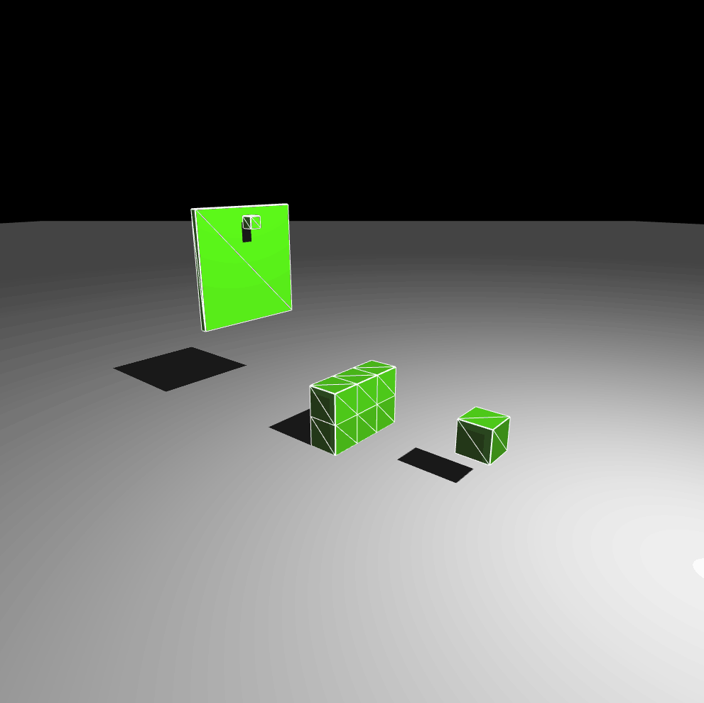
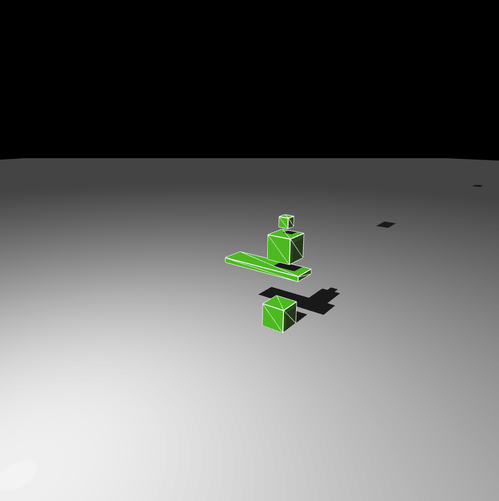

# Physics Engine
A cute little Physics Engine and Renderer I've been working on using C++ / OpenGL.

# Demos

# References
* A lot of the collision detection code comes from [Ian Millington's Physics Engine](https://github.com/idmillington/cyclone-physics).
* The collision resolution algorithm comes from [here](http://graphics.stanford.edu/papers/rigid_bodies-sig03/rigid_bodies.pdf).
* Collision reponse formulas come from [here](https://en.wikipedia.org/wiki/Collision_response).
* [Game Physics Engine Development](https://www.amazon.com/Game-Physics-Engine-Development-Commercial-Grade/dp/0123819768/ref=sr_1_1?ie=UTF8&qid=1487209617&sr=8-1&keywords=Game+Physics+Engine+Development)
* [Gaffer on Games Physics Articles](http://gafferongames.com/game-physics/)
